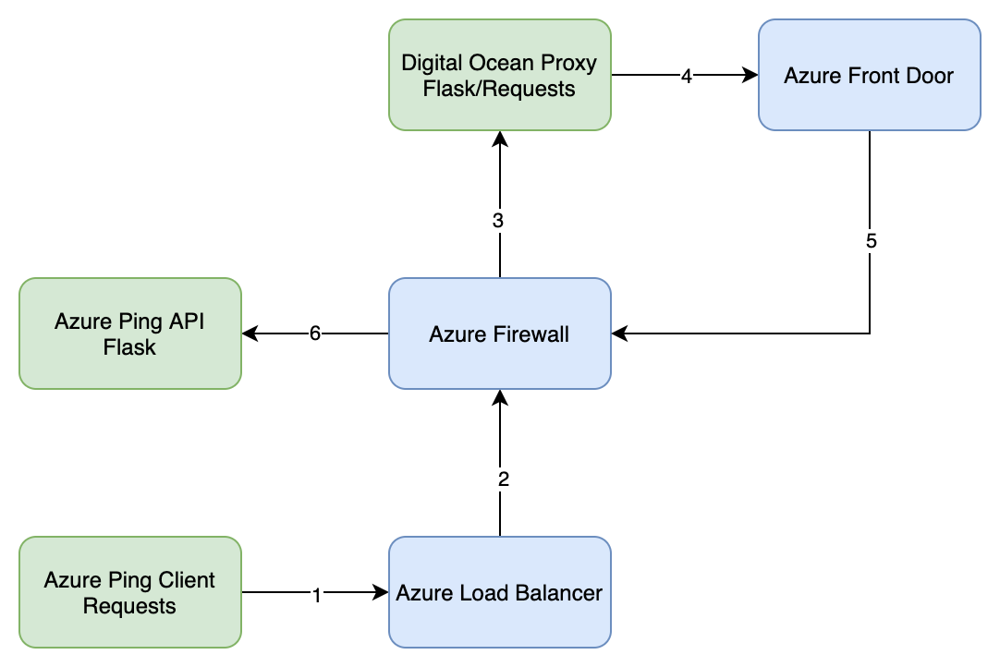

# pingthing

Prove reliable network connectivity between a host, the internet and back again in an Azure Front Door & Azure Firewall hub/spoke model.

## Description

### pingapi

Simple flask app that returns 200s on a request to `/ping` 

### pingproxy

Simple flask app that recieves requests and attempts to establish a connection back to `pingapi` if succesful, return a 200, if not, return a 500

### pingclient

Simple requests app that fires requests to pingproxy (or anything) as fast as possible.

## Configuration

Configure the following environment variables:
* `PINGAPI_URL`
* `PINGPROXY_URL`

## Disclaimer

Don't use this, this is obviously terrible code I whipped up to prove a point to somebody.
